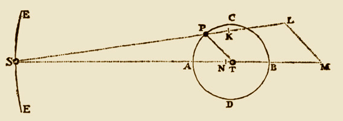

# doodson.m



This function gives the parameters for about 40 main wave components of Earth tides due to Sun and Moon (annual, semiannual, monthly, fortnightly, diurnal, semidiurnal, ...) using the harmonic development of Arthur Thomas Doodson [1890-1968]. For a given wave, it returns in a structure the 6 Doodson's arguments, wave Darwin's symbol, wave description and the wave period (in days).

## Example
```matlab
X=doodson('M2')
   X =

     symbol: {'M2'}
       name: {'Principal lunar semidiurnal'}
    doodson: [2 0 0 0 0 0]
     period: 0.5175
```
Type doodson without argument to see the list of available waves.

## Author
**François Beauducel**, [IPGP](www.ipgp.fr), [beaudu](https://github.com/beaudu), beauducel@ipgp.fr 

## Documentation
Type 'doc doodson' for syntax and examples.
