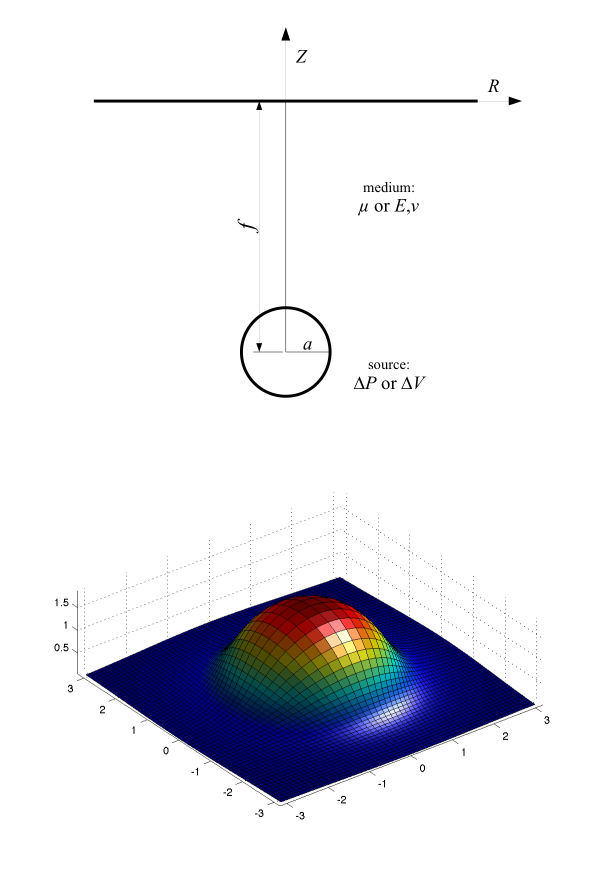

# MOGI: point source in elastic half-space

The Mogi [1958] model calculates analytical solution for surface deformation due to a point source in an elastic half-space. This model is widely used to simulate ground deformation produced by local perturbation like volcanic magma chamber. It computes displacements, tilt and strain in a polar space, due to a volume variation at depth [Anderson, 1936] or an isotropic pressure variation in a spherical source [Mogi, 1958].

The proposed Matlab script is a literal transcription of Mogi's simple equations, extended to non-isotropic medium (Poisson's ratio different from 0.25). All parameters can be vectorized. See help for syntax, and script comments for details.

## Example
Example for a 3-D plot of exagerated deformed surface due to a 1-bar overpressure in a 10-cm radius sphere at 1-m depth in rock:
```matlab
[x,y] = meshgrid(-3:.1:3);
[th,rho] = cart2pol(x,y);
[ur,uz] = mogi(rho,1,0.1,1e5,10e9,0.25);
[ux,uy] = pol2cart(th,ur);
ps = 1e8;
surf(x+ux*ps,y+uy*ps,uz*ps), axis equal, light
```


