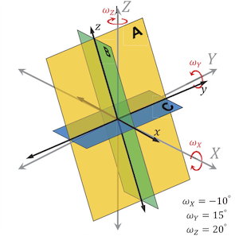
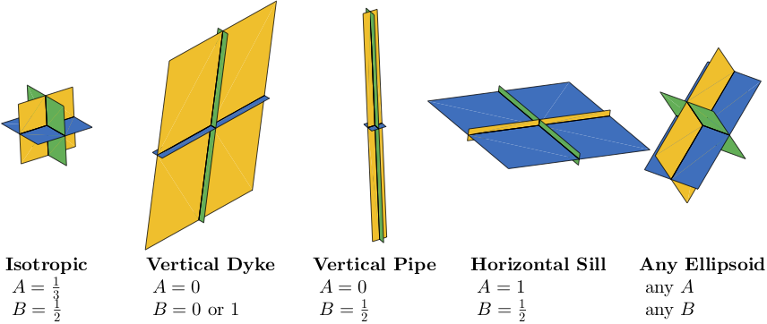

# CDM: Compound Dislocation Model

*Nikkhoo et al.* [2017] model calculates analytical solution for surface displacements due to a combination of three mutually orthogonal tensile displocations (one horizontal and two vertical) freely oriented in space (three angles of rotation) in an elastic half-space.

This model can be used to simulate inflation or deflation of a volumetric source, like magmatic instrusion under a volcano and GPS stations measurements at surface. The model is able to approximate the most common shapes of source: isotropic (sphere), sill, dyke, pipe, or any ellipsoid in any orientation in space. In practice, this code is able to replace, especially in the far-field, former [Mogi](../mogi), [Sun](../sun), [Okada](../okada), Davis, Bonaccorso, and other analytic models of simple sources in elastic half-space that have been proposed in the last century.

Nikkhoo has proposed two versions of analytical solutions for CDM (see [www.volcanodeformation.com](http://www.volcanodeformation.com)):

* the **CDM** is composed of 3 finite rectangular dislocations of different semi-axe lengths, all with the same amount of opening. The source is fully described by a total of 10 parameters;
* the **pCDM** is composed of 3 point tensile dislocations of different potencies (volume variations). The equations are simplier and much faster than CDM. Source is fully described by only 9 parameters. This is the best choice for far-field observations.



*Figure 1. The three rectangular discontinuities composing the CDM and rotation angle definition (from Nikkhoo et al., 2017).*


The proposed scripts are literal transcriptions of the Nikkhoo's equations from original script `CDM.m` and `pCDM.m`, except for:

- the source coordinates is set to (0,0) so observation points (x,y) are relative to it;
- the equations have been vectorized for all input source parameters. So massive computation can be achieved on large vectors, matrix or even N-D matrix of inputs, which is useful for inversion;
- for pCDM we introduced a difference from original function to have the total potency as one of the input parameter: the 3 volume potencies have been redefined as a total volume variation *dVtot* and two dimensionless shape parameters *A* and *B*, between 0 and 1, defined as in the upper table (see Figure 2 for examples).

### Common input/output parameters ###

|Input arguments|Description|
|-------------:|:----------|
|X and Y| Horizontal coordinates (East, North) of calculation points relative to source located at (0,0). For original codes `CDM.m` and `pCDM.m` it corresponds to X-X0 and Y-Y0, respectively.|
|DEPTH  | Depth of the source from the free surface, same unit as X and Y. Note that you might set DEPTH as a vector/matrix of the same size as X and Y and add to it the elevation for each observation points in order to approximate the topographic effects (method from *Williams and Wadge*, 2000).|
|OMEGAX OMEGAY OMEGAZ| Clockwise rotation angles around X, Y and Z axes, respectively, that specify the orientation of the CDM in space, in degrees.|
|NU | Poisson's ratio, optional and dimensionless (default is 0.25 for an isotropic medium).|
| | |
|**Output arguments**|**Description**|
|uE, uN, uV| Calculated displacement vector components in EFCS. Will have the same unit as X, Y and DEPTH.|

## CDM code

```
[uE,uN,uV,DV]=cdmv(X,Y,DEPTH,OMEGAX,OMEGAY,OMEGAZ,AX,AY,AZ,OPENING,NU);
```

|Input arguments|Description|
|-------------:|:----------|
|AX AY AZ| Semi-axes of the CDM along the X, Y and Z axes, respectively, before applying the rotations. AX, AY and AZ have the same unit as X and Y.|
|OPENING | The opening (tensile component of the Burgers vector) of the rectangular dislocation that form the CDM. Same unit as AX, AY and AZ.|
| | |
|**Output arguments**|**Description**|
|dV| Potency of the CDM. DV has the unit of volume, i.e. the unit of displacements, OPENING and CDM semi-axes to the power of 3.|


### cdmv.m

Pure Matlab/GNU Octave code fully vectorized (no loop, no if condition). Type "doc cdmv" for help, syntax and example, and see script comments for details.


## pCDM codes

```
[uE,uN,uV]=pcdmv(X,Y,DEPTH,OMEGAX,OMEGAY,OMEGAZ,DV,A,B,NU);
```



*Figure 2. Example of source shapes that can be simulated by pCDM. On this figure surface of each point dislocation is enlarged to be proportional to its associated volume variation.*


|Input arguments|Description|
|-------------:|:----------|
|DV| Total potency DV = dVX+dVY+dVZ of the point tensile dislocations that before applying the rotations are normal to the X, Y and Z axes, respectively. The potency has the unit of volume (the unit of displacements and semi-axes to the power of 3).|
|A | Horizontal over total volume variation ratio A = dVZ/DV.|
|B | Vertical volume variation ratio B = dVY/(dVX+dVY).|

### pcdmv.m

Pure Matlab/GNU Octave code fully vectorized (no loop, no if condition). Type "doc pcdmv" for help, syntax and example, and see script comments for details.

### pcdmv.c
This is a transcription of `pcdmv.m` in C language that includes complementary subfunction `mexFunction()` to be compiled as a MEX file (Matlab/Octave executable). To make the binary for your computer architecture, you must install a compiler first then type at the Matlab/Octave command line:

	>> mex pcdmv.c

### pcdmdesc.m
A small script to transform source shape parameters *A* and *B* to a human-readable string. It uses a default 10% tolerancy. Examples:

	>> pcdmdesc(1,0)
	    'sill'
	>> pcdmdesc(0,0.5)
	    'vertical pipe'
	>> pcdmdesc(1/3,0.5)
	    'isotropic'
	>> pcdmdesc(0,1)
	    'vertical NS dyke'

Type "doc pcdmdesc" for help, syntax and examples.

### plotpcdm.m
A first tentative script to represent a pCDM source on a graph, in 3-D or 2-D projections, from shape parameters A and B.

## Notes on vectorization
The codes have almost the same input parameters but different behaviors with input vectors and matrix:

### Originals by Nikkhoo (2016)

**CDM.m** accepts vectors or matrix only for X and Y observation points coordinates. Other input parameters defining the source X0, Y0, DEPTH, OMEGAX, OMEGAY, OMEGAZ, AX, AY, AZ, OPENING and NU must be scalars. If the CDM source is partly/totally above the surface, the code exists with an error.

**pCDM.m** accepts vectors or matrix only for X and Y observation points coordinates. Other input parameters defining the source X0, Y0, DEPTH, OMEGAX, OMEGAY, OMEGAZ, DVX, DVY, DVZ, and NU must be scalars.

### Vectorized Matlab/GNU Octave
**cdmv.m** accepts scalar, vector or matrix of the same size for all input parameters X, Y, DEPTH, OMEGAX, OMEGAY, OMEGAZ, AX, AY, AZ, OPENING, and optional NU, and any of them can be also a scalar, excepted for X: since output arguments will be set to the same size as X, if X is a scalar and other input arguments are vectors or matrix, you must use `repmat(X,...)` to make X also a vector or matrix. For other input arguments, any mixing between matrix and scalars are acceptable (if all matrix have the same size, of course). If the CDM source is partly/totally above the surface, the code returns NaN values.

**pcdmv.m** accepts scalar, vector or matrix of the same size for all input parameters X, Y, DEPTH, OMEGAX, OMEGAY, OMEGAZ, DV, A, B, and optional NU, and any of them can be also a scalar, excepted for X: since output arguments will be set to the same size as X, if X is a scalar and other input arguments are vectors or matrix, you must use `repmat(X,...)` to make X also a vector or matrix. For other input arguments, any mixing between matrix and scalars are acceptable (if all matrix have the same size, of course).

### Compiled C as MEX
**cdmv.c** accepts all input arguments X, Y, DEPTH, OMEGAX, OMEGAY, OMEGAZ, AX, AY, AZ, and OPENING as scalar, vector or matrix but all must have the same number of elements or size. Mixing with scalar is prohibited so you may use `repmat()` to convert any scalar to a matrix if necessary. Last input argument NU is mandatory and must be a scalar. Output arguments will be set to the size of input arguments.

**pcdmv.c** accepts all input arguments X, Y, DEPTH, OMEGAX, OMEGAY, OMEGAZ, DV, A, and B as scalar, vector or matrix but all must have the same number of elements or size. Mixing with scalar is prohibited so you may use `repmat()` to convert any scalar to a matrix if necessary. Last input argument NU is mandatory and must be a scalar. Output arguments will be set to the size of input arguments.

### Benchmarks
This a basic comparison of computational times using a 2.7GHz Intel Core i7 computer for 100,000 different random models computed for 10 observation points (X,Y). All with constant NU = 0.25. Times are the minimum observed, generally the second or third run to avoid load/compilation delays.

Since the original scripts where vectorized for observation points only, the gain is mostly on the source parameters.

|code| CDM @Matlab| CDM @Octave | pCDM @Matlab| pCDM @Octave | 
|----:|--------:|-------:|----:|----:|
|original .m       | 3 mn|-     | 8.0 s|  5 mn |
|vectorized .m     |4.6 s|  15 s| 0.8 s| 1.7 s|
|compiled .mex (.c)|2.4 s| 2.4 s| 0.4 s| 0.4 s|

## Rerefences

Nikkhoo, M., Walter, T. R., Lundgren, P. R., Prats-Iraola, P. (2017). Compound dislocation models (CDMs) for volcano deformation analyses.  *Geophys. J. Int.*, 208(2): 877-894, doi:10.1093/gji/ggw427

[www.volcanodeformation.com](http://www.volcanodeformation.com)

Williams C.A. and G. Wagde (2000). An accurate and efficient method for including the effects of topography in three-dimensional elastic models of ground deformation with applications to radar interferometry, *J. Geophys. Res.*, 105(B4), 8103-8120.

See source codes for copyright and full license information.
