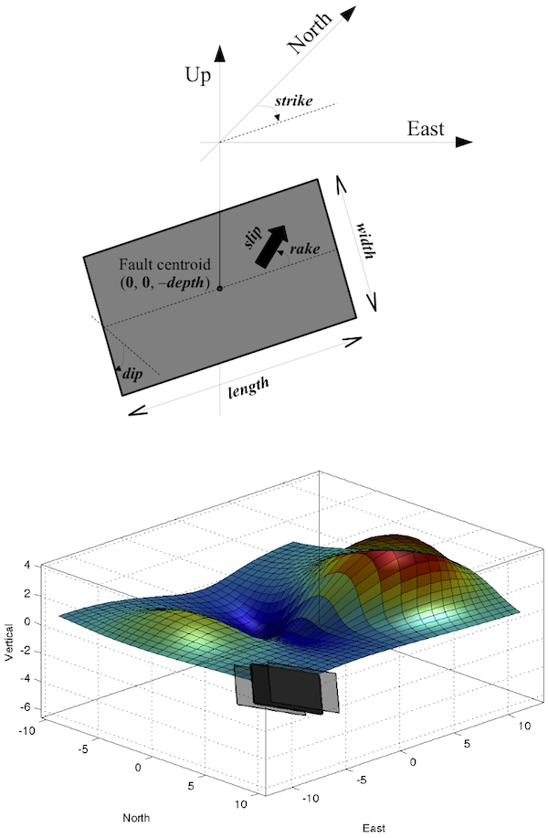

# OKADA: Surface deformation due to a finite rectangular source

The Okada [1985] model calculates analytical solution for surface deformation due to shear and tensile faults in an elastic half-space. This model is widely used to simulate ground deformation produced by local perturbation like tectonic faults (earthquakes) or volcanic dykes (magmatic intrusion). Given rectangular fault geometry (length, width, depth, strike, dip) and 3-component dislocation amplitude (rake, slip and open), it computes the displacements, tilts and strains at the free-surface.

The proposed Matlab script is a literal transcription of the Okada's equations, except that it is transposed in a geographical referential (East, North, Up), where the fault is defined by a strike angle relative to the North, and dislocation parameters are given by: rake, slip and opening (instead of U1, U2, U3), following Aki & Richards [1980] definition. All coordinates and depth are relative to fault centroid. Lamé's constants λ and μ are replaced by Poisson's ratio ν (with a default value of 0.25 for isotropic medium), since the equations are independent of other elastic parameters. The equations are also vectorized for (x,y) coordinates and all input parameters except dip angle.

To check the consistency of numerical calculations, run the script "okada85\_checklist.m", a transcription of table 2 cases 2, 3, and 4 checklist from [Okada, 1985] paper.

See help for further details, syntax, example, and script comments for technical details.

## Example
Example for a 3D plot of exagerated deformed surface:
```matlab
[E,N] = meshgrid(linspace(-10,10,50));
[uE,uN,uZ] = okada85(E,N,2,30,70,5,3,-45,1,1,'plot');
figure, surf(E,N,uN)
```


