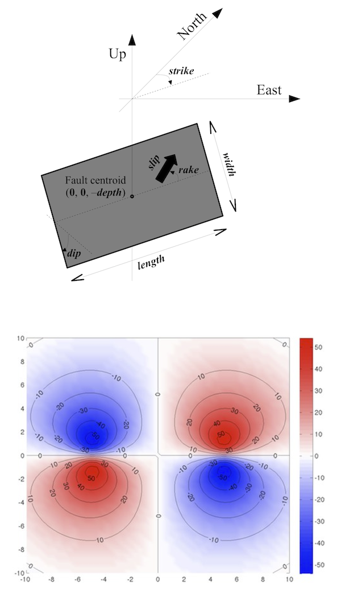

# OKUBO: Gravity change due to shear and tensile faults


kubo [1992] model calculates analytical solution for gravity changes due to shear and tensile faults in an elastic half-space (as Okada [1985] does for deformations). This model can be used to simulate gravity anomalies produced by local perturbation like tectonic faults (earthquakes) or volcanic dykes (magmatic intrusion). Given rectangular fault geometry (length, width, depth, strike, dip) and 3-component dislocation amplitude (rake, slip and open), it computes the total gravity change (potential, cavity filling and free-air) at the free-surface.

The proposed Matlab script is a literal transcription of the Okubo's equations, except for the fault geometry that it is transposed in a geographical referential (East, North, Up), where the fault is defined by a strike angle relative to the North, and dislocation parameters are given by: rake, slip and opening (instead of U1, U2, U3), following Aki & Richards [1980] definition. All coordinates and depth are relative to fault centroid.

The equations are also vectorized for (x,y) coordinates and all parameters except dip angle.

Type "doc okubo92" for help, syntax and example, and see script comments for details.

## Example
```matlab
[E,N] = meshgrid(linspace(-10,10,50));
dG = okubo92(E,N,6,90,90,10,10,0,5,0,2670);
figure, pcolor(E,N,1e8*dG), shading interp
hold on, [c,h]=contour(E,N,1e8*dG,-50:10:50,'k'); clabel(c,h), hold off
colorbar, polarmap
```


