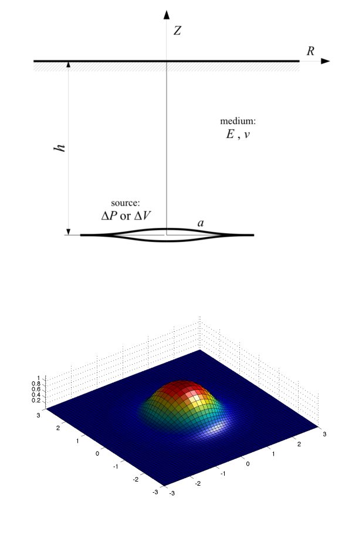

# SUN: Deformation from penny-shaped crack in elastic half-space

The Sun [1969] model calculates analytical solution for surface deformation due to hydrostatic pressure inside a horizontal circular fracture (“penny-shaped”) in an elastic half-space.

The proposed Matlab script is a literal transcription of the Sun's paper equations. The equations are also vectorized for all input parameters. See help for syntax, and script comments for details.

## Example
Example for a 3D plot of exagerated deformed surface:
```matlab
[x,y] = meshgrid(-3:.1:3);
[th,rho] = cart2pol(x,y);
[ur,uz] = sun69(rho,1,.5,1e6,10e9,0.25);
[ux,uy] = pol2cart(th,ur);
ps = 5e4;
surf(x+ux*ps,y+uy*ps,uz*ps), axis equal, light
```


